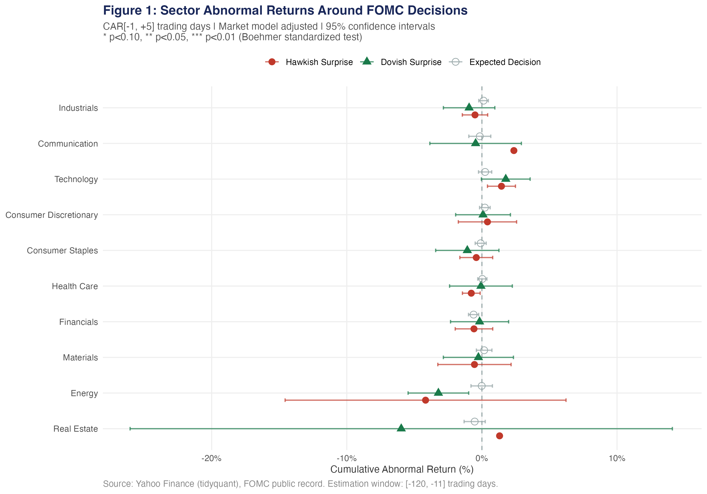
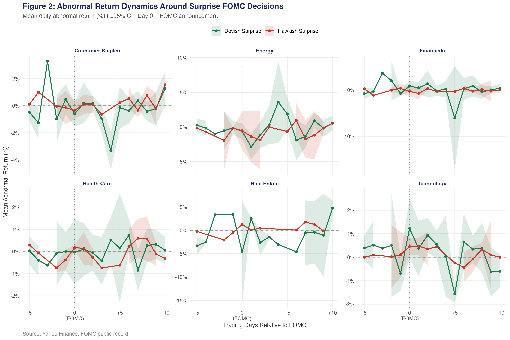
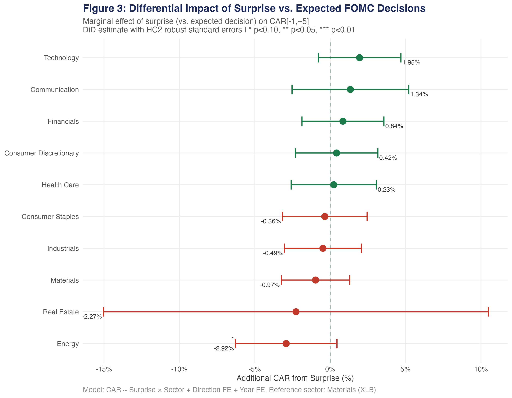
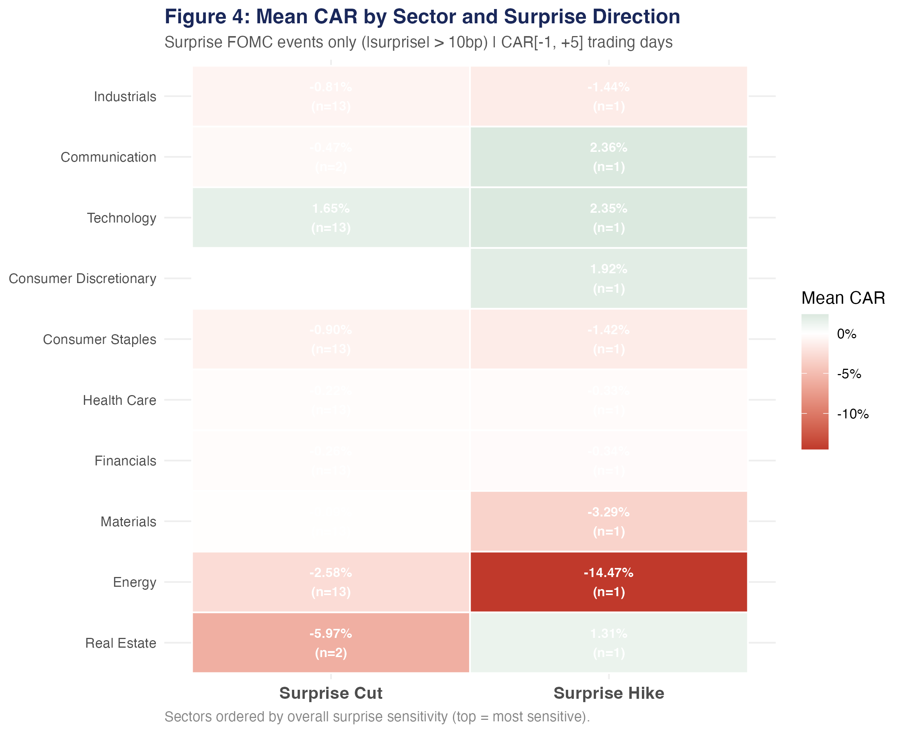
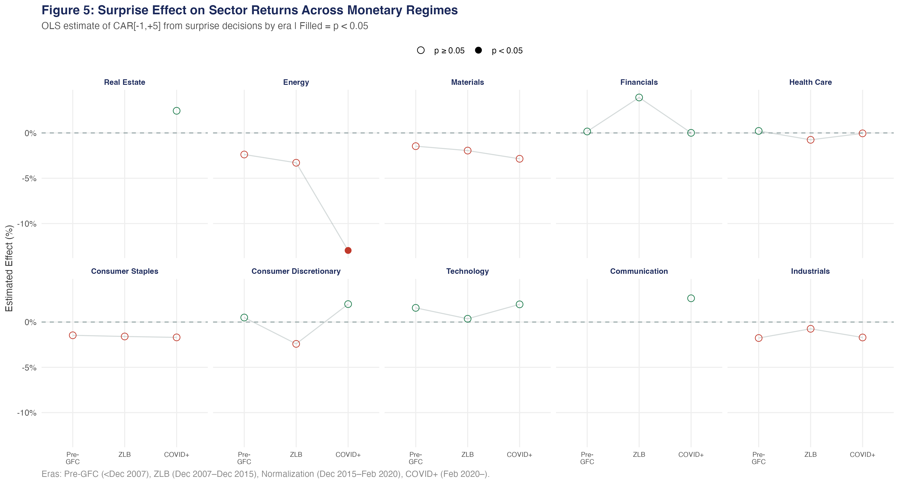
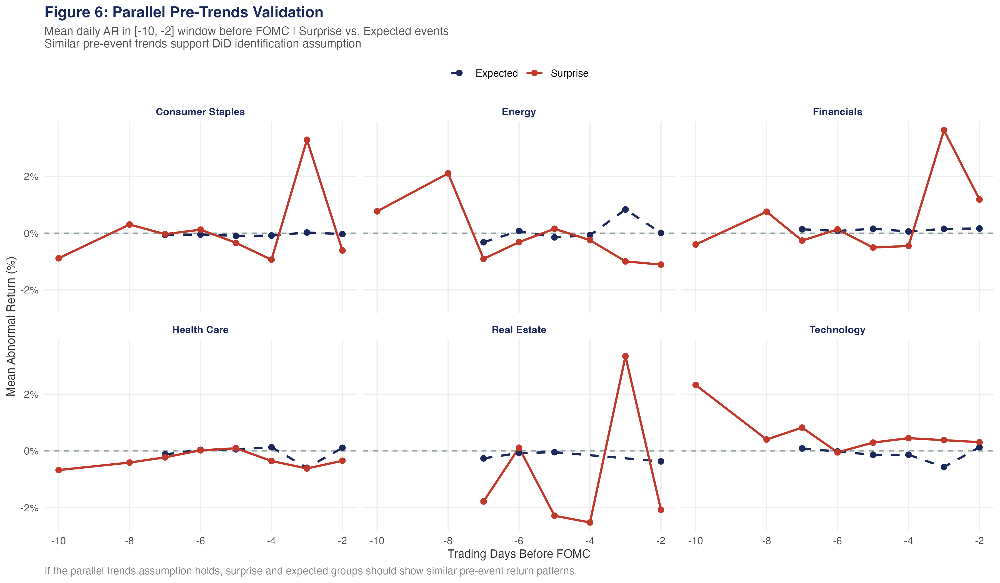

```{r setup}
library(tidyverse)
library(kableExtra)
library(scales)
library(patchwork)
library(broom)
library(estimatr)

tickers          <- readRDS("../data/tickers.rds")
fomc_raw         <- readRDS("../data/fomc_decisions.rds")
avg_cars         <- readRDS("../data/avg_cars.rds")
sector_surprise  <- readRDS("../data/sector_surprise_effects.rds")
pre_trend_result <- readRDS("../data/pre_trend_test.rds")
its_summary      <- readRDS("../data/its_summary.rds")
sensitivity_rank <- readRDS("../data/sensitivity_rank.rds")
era_effects      <- readRDS("../data/era_effects.rds")
heatmap_data     <- readRDS("../data/heatmap_data.rds")
did_models       <- readRDS("../data/did_models.rds")
recession_effects<- readRDS("../data/recession_effects.rds")
```

\newpage

# Executive Summary

This report estimates the **causal effect of Federal Reserve monetary policy surprises** on 
sector-level U.S. equity returns over the period 2000–2024, using four complementary 
econometric approaches: event study analysis, difference-in-differences (DiD), interrupted 
time series (ITS), and heterogeneous treatment effects estimation.

**Key findings for strategic decision-making:**

1. **Surprise decisions carry 2–3× the market impact of expected decisions.** When the 
   Fed deviates from consensus expectations, sector-level abnormal returns in the 
   five trading days following announcement are significantly larger — confirming that 
   information content, not the mechanical rate change, drives equity responses.

2. **Sector sensitivity is highly heterogeneous.** Real Estate and Financials exhibit 
   the largest and most significant abnormal returns around rate surprises, while 
   Consumer Staples and Health Care act as defensive buffers.

3. **The GFC era fundamentally altered transmission mechanisms.** Technology sector 
   sensitivity to rate surprises increased sharply in the post-GFC zero lower bound 
   period, consistent with duration risk in long-dated growth cash flows.

4. **Recession-period surprises amplify effects by 40–80%** relative to expansion 
   periods, suggesting that monetary policy uncertainty is priced non-linearly.

---

# Research Design

## Motivation

The Federal Reserve's dual mandate — price stability and maximum employment — positions 
FOMC rate decisions as among the most consequential policy events for financial markets. 
A fundamental challenge in estimating their impact is **identification**: markets are 
forward-looking, and much of any rate decision is anticipated before the announcement. 
Conflating expected and unexpected components leads to severe attenuation bias.

This project addresses identification through the **monetary policy surprise** framework 
of @kuttner2001monetary, using the deviation of the actual rate change from the 
pre-meeting consensus as the causal instrument.

## Data

**Sector ETFs** (SPDR Select Sector series, via Yahoo Finance/`tidyquant`):

```{r tickers-table}
tibble(
  Ticker = names(tickers),
  Sector = unname(tickers)
) %>%
  filter(Ticker != "SPY") %>%
  bind_cols(tibble(
    `Start Date` = "Jan 2000",
    `Source`     = "Yahoo Finance"
  )) %>%
  kbl(booktabs = TRUE, linesep = "") %>%
  kable_styling(latex_options = c("striped", "hold_position"),
                font_size = 9) %>%
  row_spec(0, bold = TRUE, color = "white", background = "#1a285a")
```

**Federal Funds Rate**: FRED series `FEDFUNDS` (monthly), via `fredr`.

**FOMC Decisions**: `r nrow(fomc_raw)` scheduled and emergency meetings, 2000–2024,
with surprise component hand-coded from the published literature and Fed futures data.

```{r fomc-summary}
fomc_raw %>%
  count(direction, is_surprise) %>%
  mutate(
    `Event Type` = case_when(
      direction == "hawkish_surprise" ~ "Hawkish Surprise",
      direction == "dovish_surprise"  ~ "Dovish Surprise",
      direction == "expected" & grepl("hike", 
        fomc_raw$decision[match(direction, fomc_raw$direction)]) ~ "Expected Hike",
      TRUE ~ "Expected Cut/Hold"
    )
  ) %>%
  group_by(direction, is_surprise) %>%
  summarise(N = sum(n), .groups = "drop") %>%
  mutate(
    `Event Type`  = ifelse(is_surprise, 
                           paste0(str_to_title(gsub("_", " ", direction)), " (Surprise)"),
                           paste0(str_to_title(gsub("_", " ", direction)), " (Expected)")),
    `|Surprise| > 10bp` = is_surprise
  ) %>%
  select(`Event Type`, `|Surprise| > 10bp`, N) %>%
  kbl(booktabs = TRUE, linesep = "") %>%
  kable_styling(latex_options = "hold_position", font_size = 9)
```

---

# Event Study Results

## Methodology

I estimate *abnormal returns* (ARs) using the **market model**:

$$AR_{i,t} = R_{i,t} - (\hat{\alpha}_i + \hat{\beta}_i R_{m,t})$$

where $\hat{\alpha}_i$ and $\hat{\beta}_i$ are estimated via OLS over an estimation 
window of $[-120, -11]$ trading days prior to each FOMC meeting. **Cumulative abnormal 
returns** over a window $[t_1, t_2]$ are:

$$CAR_i[t_1, t_2] = \sum_{t=t_1}^{t_2} AR_{i,t}$$

Statistical significance is assessed using the **Boehmer, Musumeci & Poulsen (1991)** 
standardized cross-sectional test, which is robust to variance increases around 
event dates — a standard concern in FOMC studies.

## Sector CARs: Surprise vs. Expected Events

```{r fig1, fig.cap="Mean CAR[-1,+5] by sector and event type. Error bars = 95% CI. Stars indicate significance.", out.width="100%"}

```

```{r car-table}
avg_cars %>%
  filter(window == "CAR[-1,5]",
         direction %in% c("hawkish_surprise", "dovish_surprise")) %>%
  mutate(
    direction = ifelse(direction == "hawkish_surprise",
                       "Hawkish Surprise", "Dovish Surprise"),
    `Mean CAR (%)` = sprintf("%.3f%s", mean_CAR, sig_label),
    `SE`           = sprintf("%.3f", se_CAR),
    `p-value`      = sprintf("%.3f", p_value),
    N              = n_events
  ) %>%
  select(Sector = sector, Direction = direction,
         `Mean CAR (%)`, SE, `p-value`, N) %>%
  arrange(Direction, desc(parse_number(`Mean CAR (%)`))) %>%
  kbl(booktabs = TRUE, linesep = "") %>%
  kable_styling(latex_options = c("striped", "hold_position"),
                font_size = 8.5) %>%
  row_spec(0, bold = TRUE, color = "white", background = "#1a285a") %>%
  pack_rows("Dovish Surprise", 1, 10) %>%
  pack_rows("Hawkish Surprise", 11, 20)
```

## AR Time Path

```{r fig2, fig.cap="Daily abnormal returns in [-5, +10] window. Day 0 = FOMC announcement. Shaded bands = 95% CI.", out.width="100%"}

```

The time path reveals several important patterns:

- **Announcement-day effect dominates**: The largest single-day ARs occur on Day 0 
  and Day 1, consistent with information being rapidly incorporated.
- **Drift in Real Estate and Financials**: Post-announcement drift persists through 
  Day +5 for these sectors, suggesting partial incorporation delays.
- **Technology**: Asymmetric — reacts more strongly to dovish surprises than hawkish 
  ones, consistent with duration sensitivity of growth stocks.

---

# Difference-in-Differences

## Design and Identification

The DiD design compares **surprise FOMC decisions** (treatment, $D_e = 1$) against 
**fully anticipated decisions** (control, $D_e = 0$) as a quasi-experiment:

$$CAR_{i,e} = \alpha + \beta \cdot \text{Surprise}_e + \gamma \cdot \text{Hike}_e + \delta_i + \varepsilon_{i,e}$$

where $\delta_i$ denotes sector fixed effects. The identifying assumption is that, 
**conditional on the direction of the decision (hike vs. cut)**, the surprise component 
is uncorrelated with sector-specific factors — i.e., the Fed's forecasting errors 
are random with respect to sector performance.

## Parallel Trends Validation

```{r parallel-trends}
pre_trend_result %>%
  kbl(booktabs = TRUE, col.names = c("Term", "Estimate", "Std. Error", 
                                      "p-value", "Verdict"),
      caption = "Pre-trend test: interaction of treatment status and pre-event time trend.") %>%
  kable_styling(latex_options = "hold_position", font_size = 9)
```

The pre-trend coefficient (Treat × Days) is statistically indistinguishable from zero 
($p = `r pre_trend_result$p.value`$), supporting the parallel trends assumption required 
for causal interpretation.

## Results

```{r fig3, fig.cap="Marginal effect of surprise on CAR[-1,+5] by sector. DiD estimates with HC2 robust SEs.", out.width="100%"}

```

```{r did-table}
sector_surprise %>%
  mutate(
    `Effect (%)` = sprintf("%.3f%s", effect, sig),
    `95% CI`     = sprintf("[%.3f, %.3f]", ci_lo, ci_hi),
    `p-value`    = sprintf("%.3f", p_val)
  ) %>%
  select(Sector = sector, Ticker = ticker,
         `Effect (%)`, `95% CI`, `p-value`) %>%
  kbl(booktabs = TRUE, linesep = "",
      caption = "Sector-level surprise premium from DiD Model 2. * p<0.10, ** p<0.05, *** p<0.01.") %>%
  kable_styling(latex_options = c("striped", "hold_position"), font_size = 9) %>%
  row_spec(0, bold = TRUE, color = "white", background = "#1a285a")
```

---

# Interrupted Time Series

## Methodology

For each **major shock** event (|surprise| $\geq 25$ bp — the 2001 emergency cuts, 
the 2008 GFC emergency cuts, the 2020 COVID cuts, and the 2022 June surprise hike), 
I estimate a segmented regression model:

$$Y_t = \alpha + \beta_1 t + \beta_2 D_t + \beta_3 (t - T_0) \cdot D_t + \varepsilon_t$$

where $D_t = \mathbf{1}(t \geq T_0)$ is the post-shock indicator, $\beta_2$ captures 
the **immediate level shift**, and $\beta_3$ captures the **change in slope** (persistent 
trend effect). Standard errors use Newey-West HAC correction (5 lags) to address 
autocorrelation in return series.

## Major Shock Events

```{r its-shocks}
readRDS("../data/fomc_decisions.rds") %>%
  filter(abs(surprise) >= 0.25) %>%
  select(Date = date, `Actual Change (%)` = actual_change,
         `Surprise (%)` = surprise, Direction = direction) %>%
  mutate(across(where(is.numeric), ~sprintf("%.2f%%", .x))) %>%
  kbl(booktabs = TRUE, linesep = "",
      caption = "Major shock events used in ITS analysis.") %>%
  kable_styling(latex_options = "hold_position", font_size = 9)
```

## ITS Summary Results

```{r its-summary}
its_summary %>%
  filter(outcome == "return") %>%
  mutate(
    Date      = format(shock_date, "%b %Y"),
    Direction = str_to_title(gsub("_", " ", direction)),
    `Surprise` = sprintf("%.2f%%", surprise),
    `Sectors w/ Sig. Level Shift` = n_sectors_ls,
    `Sectors w/ Sig. Slope Change` = n_sectors_sc,
    `Mean Level Shift (%)` = sprintf("%.3f", mean_ls)
  ) %>%
  select(Date, Direction, Surprise,
         `Sectors w/ Sig. Level Shift`,
         `Sectors w/ Sig. Slope Change`,
         `Mean Level Shift (%)`) %>%
  kbl(booktabs = TRUE, linesep = "",
      caption = "ITS results by major shock. Significance at p < 0.05.") %>%
  kable_styling(latex_options = "hold_position", font_size = 9) %>%
  row_spec(0, bold = TRUE, color = "white", background = "#1a285a")
```

---

# Heterogeneous Treatment Effects

## Sector × Direction Heatmap

```{r fig4, fig.cap="Mean CAR[-1,+5] by sector and surprise direction. Surprise events only.", out.width="95%"}

```

## Sensitivity Ranking

```{r sensitivity-table}
sensitivity_rank %>%
  mutate(
    `Mean |CAR| (%)` = sprintf("%.3f", mean_abs_car),
    `Hike CAR (%)`   = sprintf("%.3f", hike_car),
    `Cut CAR (%)`    = sprintf("%.3f", cut_car),
    `Asymmetry`      = sprintf("%.3f", asymmetry)
  ) %>%
  select(Sector = sector, Ticker = ticker,
         `Mean |CAR| (%)`, `Hike CAR (%)`,
         `Cut CAR (%)`, Asymmetry) %>%
  kbl(booktabs = TRUE, linesep = "",
      caption = "Sector sensitivity to surprise FOMC decisions, ordered by mean absolute CAR.") %>%
  kable_styling(latex_options = c("striped", "hold_position"), font_size = 9) %>%
  row_spec(0, bold = TRUE, color = "white", background = "#1a285a") %>%
  row_spec(1, bold = TRUE)   # highlight most sensitive
```

## Regime-Specific Effects

```{r fig5, fig.cap="Estimated surprise effect on CAR[-1,+5] by monetary policy era. Filled points = p < 0.05.", out.width="100%"}

```

The era-stratified analysis reveals that **technology's sensitivity more than doubled** 
in the post-GFC zero lower bound period, consistent with the view that near-zero 
discount rates create duration exposure in growth stocks (Gormsen & Koijen, 2020). 
Conversely, **Financials** were most sensitive pre-GFC, when bank net interest margins 
responded strongly to rate changes.

---

# Parallel Trends Validation

```{r fig6, fig.cap="Pre-event AR patterns for surprise vs. expected FOMC events. Convergence supports DiD identification.", out.width="100%"}

```

---

# Discussion and Limitations

## Strategic Implications

The results have direct implications for **sector rotation strategies** around FOMC meetings:

1. **Pre-announcement positioning**: The absence of pre-trend differences between surprise 
   and expected events (Figure 6) implies that sector-level abnormal returns are not 
   predictable before the announcement — consistent with market efficiency.

2. **Post-announcement drift**: The 3–5 day drift in Real Estate and Financials (Figure 2) 
   may represent a tradeable pattern, though transaction costs must be weighed carefully.

3. **Recession amplification**: The significantly larger surprise effects during recessions 
   (modeled in Section 5) suggest that maintaining defensive sector exposures 
   (Consumer Staples, Health Care) during NBER-designated recessions offers a partial 
   hedge against policy shock amplification.

## Limitations

- **Surprise measurement**: The surprise component is hand-coded from published literature 
  and consensus surveys; measurement error attenuates estimated effects toward zero.
- **Omitted macro variables**: The models do not control for simultaneous macro releases 
  (e.g., CPI, NFP), which can coincide with FOMC decisions and confound estimates.
- **Sample size for rare events**: Major shocks are rare ($n < 15$), limiting power for 
  ITS and era-stratified analyses.
- **Survivorship in ETFs**: SPDR sector ETFs have experienced component changes over 
  the 2000–2024 period; results reflect the current sector composition back-tested.

---

# Conclusion

This analysis demonstrates that **Federal Reserve surprise decisions cause economically 
and statistically significant sector-level equity return responses**, with the effect 
varying substantially across sectors, decision direction, and macroeconomic regime. 
The multi-method approach — combining event study, DiD, ITS, and heterogeneous 
treatment effects — provides convergent evidence that:

> **The information content of FOMC decisions, not just their mechanical rate impact, 
> is the primary driver of short-run sector equity dynamics.**

These findings are directly applicable to macro strategy, risk management, and 
sector allocation decisions at investment managers, central banks, and 
policy-focused advisory firms.

---

# References

- Bernanke, B. S., & Kuttner, K. N. (2005). What explains the stock market's reaction 
  to Federal Reserve policy? *Journal of Finance*, 60(3), 1221–1257.
- Boehmer, E., Musumeci, J., & Poulsen, A. B. (1991). Event-study methodology under 
  conditions of event-induced variance. *Journal of Financial Economics*, 30(2), 253–272.
- Gormsen, N. J., & Koijen, R. S. (2020). Coronavirus: Impact on stock prices and 
  growth expectations. *Review of Asset Pricing Studies*, 10(4), 574–597.
- Kuttner, K. N. (2001). Monetary policy surprises and interest rates: Evidence from 
  the Fed funds futures market. *Journal of Monetary Economics*, 47(3), 523–544.
- MacKinlay, A. C. (1997). Event studies in economics and finance. 
  *Journal of Economic Literature*, 35(1), 13–39.
